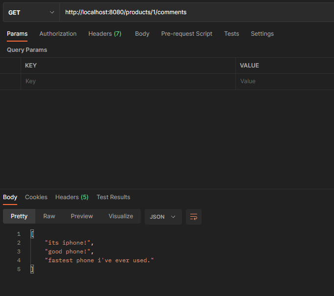

# Shopping Database

## Simple shopping database. (Java Spring Boot)
## THIS SIMPLE DATABASE HAS THREE ENTITIES.
### -> Product (Id, name, price, expireDate)
### -> User (Id, name, surname, email, phoneNumber)
### -> ProductComment (Id, comment, commentDate, productId, userId)
### As you can see, our entities have relationships with each other. So we need to create relationships with annotations.
### In the three entity files (model files in my project) you can see annotations referring to the relationships. Also, you can see the apis I wrote in the three controller files.
### Let's take a deep look on our API's. 
</br>

# USAGES
 
</br>

## 1-) Get Available Products
### 
```diff
+ localhost:8080/products/available
```
### Lists products that are not expired. (Including null dates!)


</br></br>


## 2-) Get Expired Products
### 
```diff
+ localhost:8080/products/expired
```
### Lists products that are expired.


</br></br>


## 3-) Get comments between dates for given product id

```diff
+ localhost:8080/products/1/search?startDate=2020-01-01&endDate=2024-01-01
```
### List of comments for a given product within a given date range. Has 2 query parameters.
#### params : startDate 2020-01-01 endDate 2024-01-01


</br> </br>


## 4-) Get comments between dates for given user id

```diff
+ localhost:8080/users/2/search?startDate=2020-01-01&endDate=2024-01-01
```
### List of comments for a given user within a given date range
#### params : startDate 2020-01-01 endDate 2024-01-01


</br> </br>


## 5-) Get all comments for given product id
```diff
+ localhost:8080/products/1/comments
```
### List of comments for a given product


</br> </br>


## 6-) Get all comments for given user id
```diff
+ http://localhost:8080/users/2/comments
```
### List of comments for a given user


</br>


